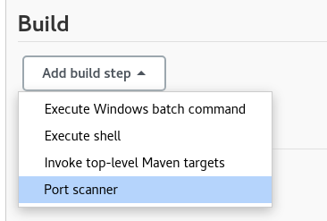
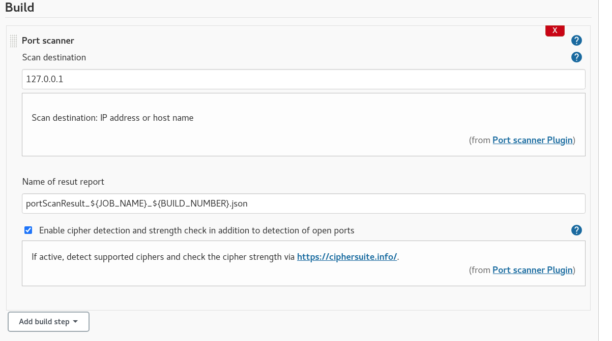
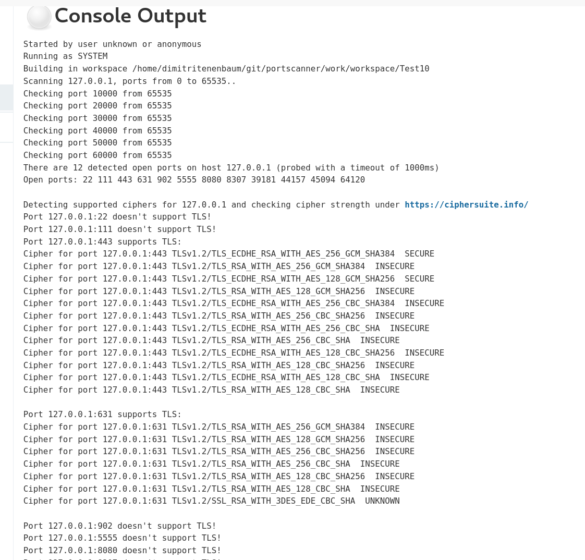
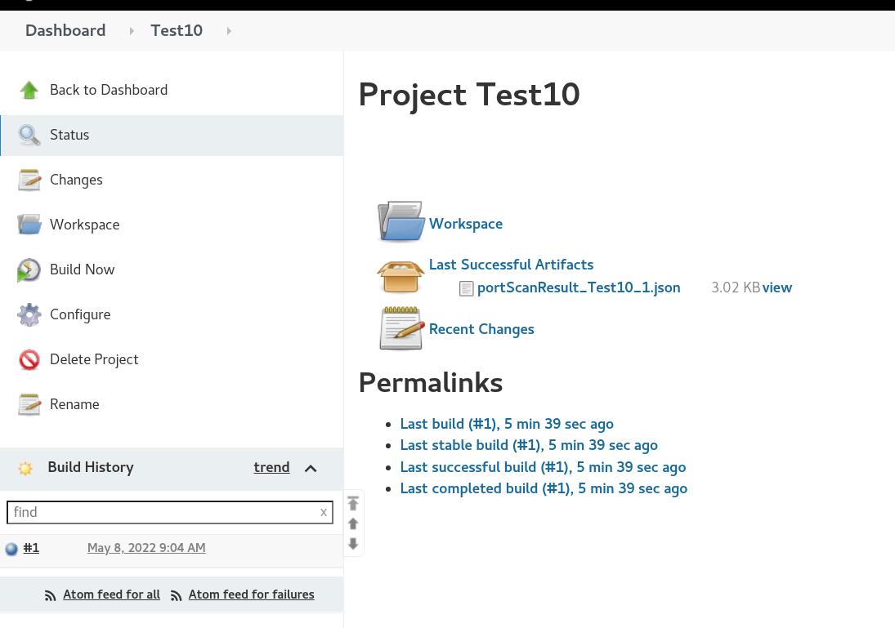
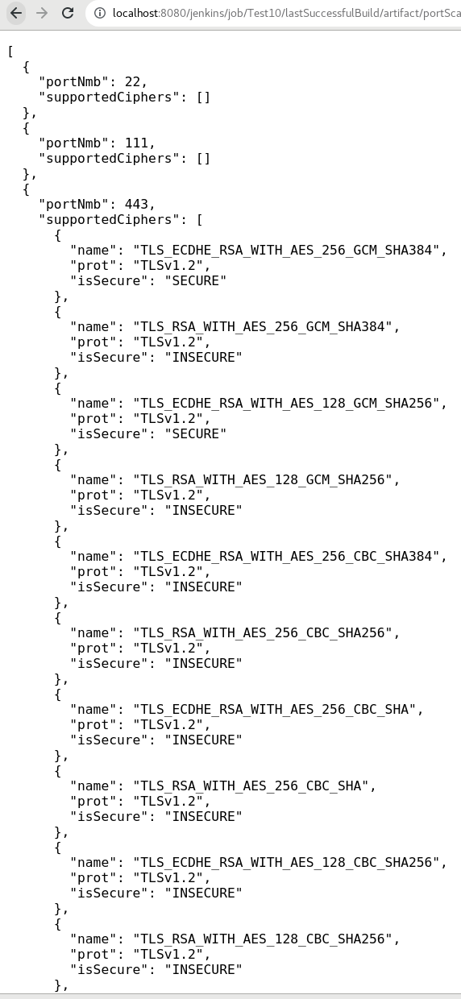

# Grype vulnerability scanner

## Introduction
This port scanner plugin performs a port scan, detects supported TLS ciphers and checks cipher strength via https://ciphersuite.info/.

## Getting started
The following screenshots describe how the plugin works.
The scan results are available in console output and as an archived JSON file. 
 

#### Port scanner as a build step:

#### Console output:

#### Scan result as job artifact:

#### Content of json file:

     

### Usage in a pipeline:
pipeline  
{  
&nbsp;agent any  
&nbsp;&nbsp;options  
&nbsp;{  
&nbsp;&nbsp;skipStagesAfterUnstable()  
&nbsp;}  
&nbsp;stages  
&nbsp;{  
&nbsp;&nbsp;stage('Build')  
&nbsp;&nbsp;{  
&nbsp;&nbsp;&nbsp;steps  
&nbsp;&nbsp;&nbsp;{  
&nbsp;&nbsp;&nbsp;step([$class: 'PortScannerStep', scanDest: '127.0.0.1', repName: 'myPortScanResult.json', enableCipherDetection: false])  
&nbsp;&nbsp;&nbsp;}  
&nbsp;&nbsp;}  
&nbsp;}  
}  

## LICENSE

Licensed under MIT, see [LICENSE](LICENSE.md)

